# BreakoutGameByLuis

Projeto de Breakout desenvolvido em Ren'Py como parte de um teste da OppaiMan.

## Requisitos

- Ren'Py 8.5.2

## Como gerar a build

1. Clone este repositório para a pasta de projetos do Ren'Py 8.5.2.
2. Abra o Ren'Py Launcher e selecione o projeto `BreakoutGameByLuis`.
3. No submenu `Actions`, clique em `Build Distributions`.
4. Em `Build Packages`, selecione o(s) pacote(s) compatível(eis) com seu sistema operacional.
5. Clique em `Build`.

## Como executar

### Executar uma build gerada

1. Acesse a pasta de distribuição criada pelo Ren'Py.
2. Descompacte o arquivo `.zip` da plataforma desejada.
3. Abra a pasta descompactada.
4. Execute o arquivo `BreakoutGameByLuis.py`.

### Executar o projeto no Ren'Py

1. Clone este repositório para a pasta de projetos do Ren'Py 8.5.2.
2. Abra o Ren'Py Launcher e selecione o projeto.
3. Clique em `Launch Project`.

## Capturas de tela

### Menu principal
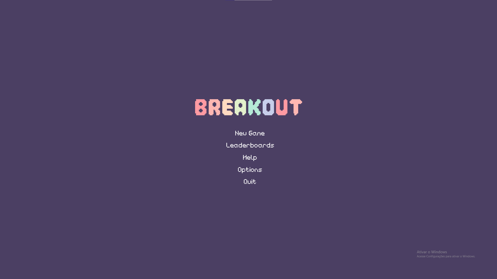

### Jogo
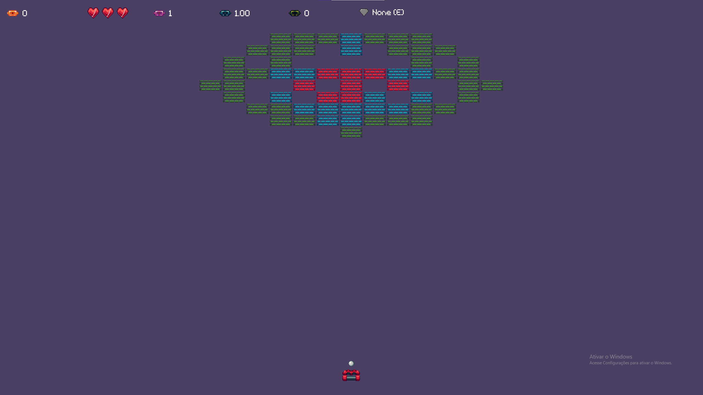

### Leaderboards
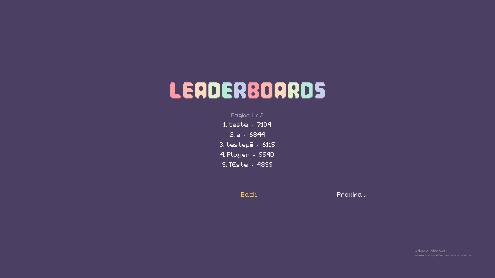

### Ajuda - Comandos
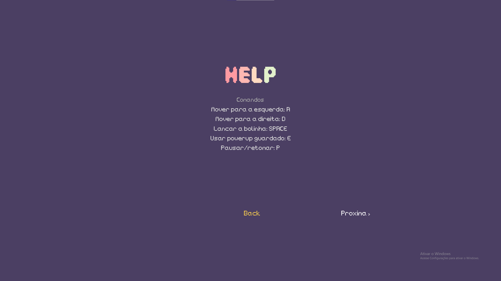

### Ajuda - Indicadores
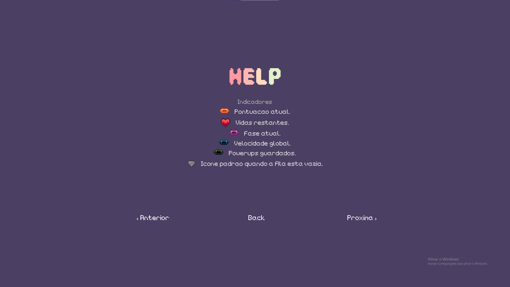

### Ajuda - Powerups
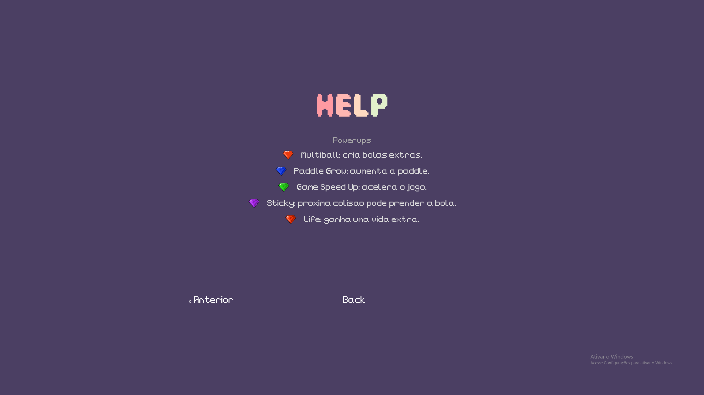

### Opcoes
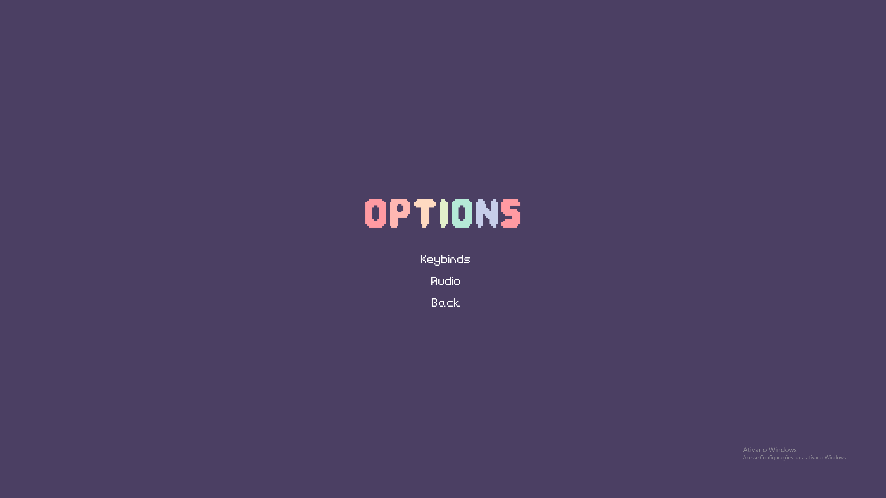

### Opcoes - Keybinds
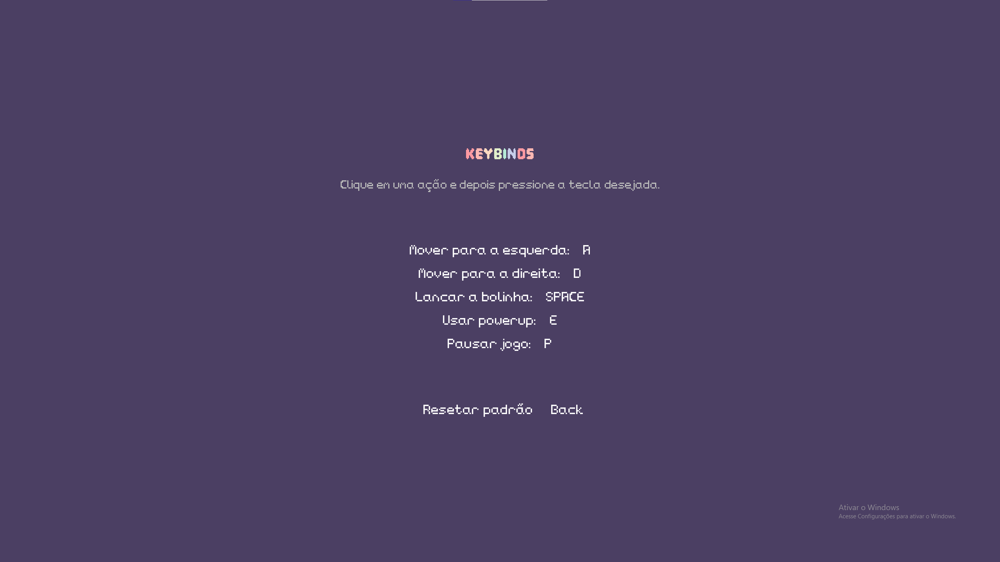

### Opcoes - Audio
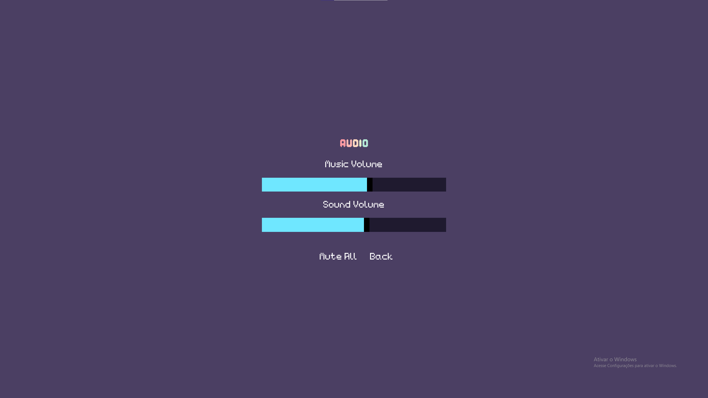

### Pausa
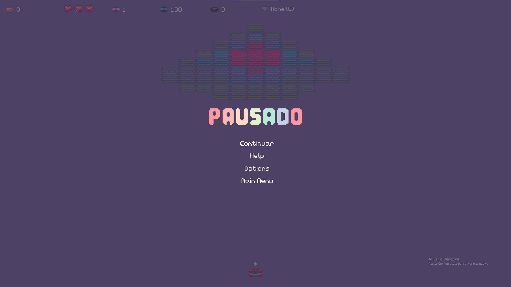

### Game over
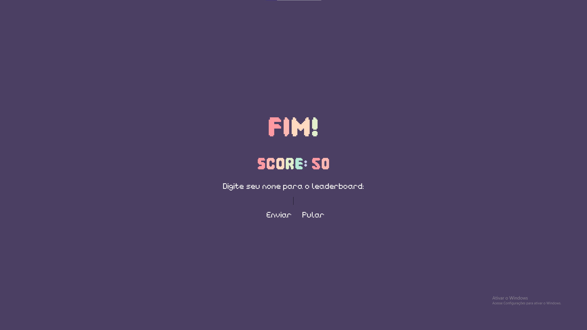
